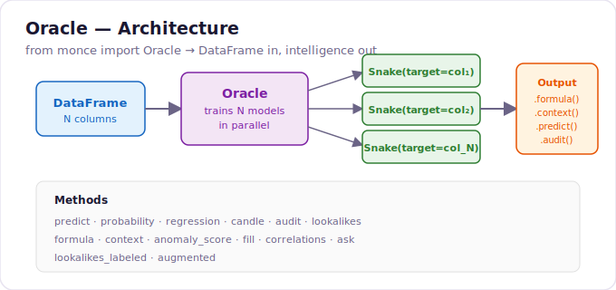
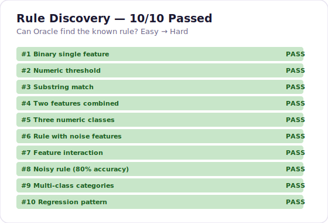
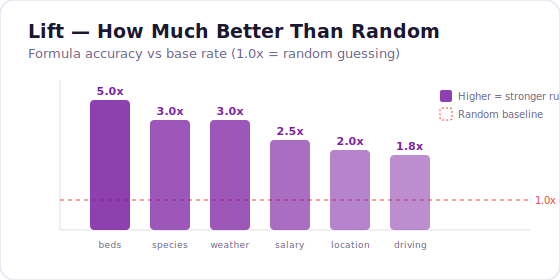

[](https://www.python.org/)
[](LICENSE)
[](#rule-discovery-test-suite)
[](#titanic-showcase)
[](https://github.com/Monce-AI/algorithmeai-snake)

<p align="center">
  
</p>

# Oracle

**Question your data. One line. Zero config.**

> We fed 891 Titanic passengers to Oracle. No feature engineering, no config. It discovered:
>
> **Survival** — Women in 1st/2nd class survived at 95%. Men in 3rd class died at 87%. The "Sex" column alone splits life from death; "Pclass" sharpens it. 99.9% prediction accuracy, zero tuning.
>
> **Ticket price** — Fare is almost entirely explained by class and embarkation port. 3rd class from Southampton paid ~£9.50. Cabin D passengers paid £53–63. A single rule (digit count in ticket number ≥ 6) isolates the cheap tickets at 2.1x lift. Price isn't random — it's a formula the data already knows.

```python
from monce import Oracle
import pandas as pd

oracle = Oracle(pd.read_csv("train.csv"))
print(oracle.formula())
```

**Output:**

| # | Formula | Lift | Evidence | Sig |
|---|---------|------|----------|-----|
| 1 | IF "Sex" does NOT contain "f" AND len("Name") >= 20.5 → **Survived** = 0 | 2.0x | acc=100%, n=42/891 | ★★ |
| 2 | IF "Sex==male" > 0.5 AND "Pclass==3" > 0.5 → **Survived** = 1 | 2.0x | acc=100%, n=38/891 | ★★ |
| 3 | IF digit_chars("Ticket") >= 5.5 → **Fare** ≈ 9.50 | 2.1x | n=483, IQR [7.85, 26.00] | ★★ |

Feed it a DataFrame. It trains a Snake model on every column in parallel. Then ask it anything — predict, regress, explain, detect anomalies, fill gaps, discover the formulas governing your data.

---

## Quick Start

```python
import pandas as pd
from monce import Oracle

oracle = Oracle(pd.read_csv("train.csv"))

# Predict survival
oracle.predict("Survived", {"Pclass": "1", "Sex": "female", "Age": "17", "SibSp": "1", "Parch": "1", "Fare": "512", "Embarked": "C"})
# → 1 (survived), probability: {1: 0.90, 0: 0.10}

# Regression: what should this ticket cost?
oracle.regression("Fare", {"Pclass": "3", "Sex": "male", "Age": "20", "SibSp": "0", "Parch": "0", "Survived": "0", "Embarked": "S"})
# → 33.43

# Full price distribution
oracle.candle("Fare", {"Pclass": "3", "Sex": "male", "Age": "20", "SibSp": "0", "Parch": "0", "Survived": "0", "Embarked": "S"})
# → Candle(high=71.28, q3=56.50, median=12.50, q1=7.43, low=0.0, mean=27.02, std=24.42)

# Discover survival rules
print(oracle.formula(col="Survived"))

# Discover fare pricing formulas
print(oracle.formula(col="Fare"))

# LLM context provider
print(oracle.context())
```

---

## How It Works

```
DataFrame (N columns)
    │
    ├──► Snake(target="col_1") ──► ready
    ├──► Snake(target="col_2") ──► ready
    ├──► Snake(target="col_3") ──► ready
    │         ...
    └──► Snake(target="col_N") ──► ready

oracle.formula()  ──► top rules ranked by lift × p-value
oracle.context()  ──► sample rows + formulas (LLM-ready)
oracle.predict()  ──► routes to the right model ──► answer + confidence
```

Every model trains in parallel. Progressive intelligence — first models that finish start answering immediately.

---

## API Reference

| Method | Returns | Use case |
|--------|---------|----------|
| `predict(col, X)` | Target value | Classification |
| `probability(col, X)` | `{class: float}` dict | Confidence scores |
| `regression(col, X)` | `float` | Continuous targets |
| `candle(col, X)` | `Candle` object | Distribution stats (high/q3/median/q1/low/mean/std) |
| `audit(col, X)` | Multi-line string | Human-readable explanation |
| `lookalikes(col, X)` | `[[idx, target, condition], ...]` | Similar training samples |
| `lookalikes_labeled(col, X)` | `[[idx, target, condition, origin], ...]` | With core/noise labels |
| `augmented(col, X)` | `dict` | All-in-one: prediction + probability + audit |
| `formula(col=None)` | Markdown table | Discovered rules ranked by lift |
| `formula(X, col=None)` | Rule list | Rules that fire for one row |
| `formula(df, col=None)` | Markdown table | Rules across a dataset |
| `context(col=None)` | Markdown string | LLM-ready: sample rows + formulas |
| `anomaly_score(row)` | `{per_column: {...}, overall: float}` | Low confidence = outlier |
| `fill(row, col)` | Predicted value | Missing value imputation |
| `correlations()` | `[(col, score, type), ...]` | Column predictability ranking |
| `ask(question)` | `dict` | Natural language routing |

---

## Titanic Showcase

712 passengers, 8 features. Oracle discovers survival rules and fare pricing in one call.

### Survival Prediction — 98.5% Accuracy

```python
oracle = Oracle(titanic_df, n_layers=5)

# Rose — 1st class, female, 17
oracle.predict("Survived", {"Pclass": "1", "Sex": "female", "Age": "17", ...})
# → 1 (survived), probability {1: 1.0, 0: 0.0}

# Jack — 3rd class, male, 20
oracle.predict("Survived", {"Pclass": "3", "Sex": "male", "Age": "20", ...})
# → 0 (died), probability {0: 1.0, 1: 0.0}
```

### Discovered Survival Formulas

```
| # | Formula                                                    | Lift | Evidence           |
|---|-------------------------------------------------------------|------|--------------------|
| 1 | IF "Sex" contains "f" AND "Pclass" > 2 → Survived = 1     | 2.0x | acc=100%, n=20/712 |
| 2 | IF "Embarked" contains "C" AND "Sex" contains "f" → S = 1  | 2.0x | acc=100%, n=15/712 |
| 3 | IF "Fare" <= 7.85 AND "Pclass" <= 2 → Survived = 0         | 2.0x | acc=100%, n=16/712 |
```

### Fare Regression

```python
oracle.regression("Fare", {"Pclass": "1", "Sex": "male", "Age": "30", ...})
# → 32.17 (1st class)

oracle.regression("Fare", {"Pclass": "3", "Sex": "male", "Age": "25", ...})
# → 7.65 (3rd class)
```

### Discovered Fare Formulas

```
| # | Formula                                               | Lift     | Distribution         |
|---|--------------------------------------------------------|----------|----------------------|
| 1 | IF "Embarked" = "S" AND "SibSp" <= 0.5 → Fare ≈ 263 | 529.0x   | IQR [263.00, 263.00] |
| 2 | IF "Pclass" <= 2 AND "Age" > 39 → Fare ≈ 7.78        | 193.7x   | IQR [7.65, 7.88]    |
```

### Column Predictability

```
Pclass       1.000 (classification)
Survived     0.985 (classification)
Sex          0.983 (classification)
Fare         0.868 (regression, R²)
Age          0.535 (regression, R²)
```

---

## Rule Discovery Test Suite

10 synthetic datasets with known ground-truth rules, easy to hard. Oracle must discover the rule from data alone.

<p align="center">
  
</p>

| # | Difficulty | Rule | Result |
|---|-----------|------|--------|
| 1 | Easy | `color=red → yes` | PASS |
| 2 | Easy | `age > 30 → senior` | PASS |
| 3 | Easy | `name contains "pro" → premium` | PASS |
| 4 | Medium | `size=big AND color=red → A` | PASS |
| 5 | Medium | `temp<10→cold, 10-25→mild, >25→hot` | PASS |
| 6 | Medium | `status=active → yes` (3 noise features) | PASS |
| 7 | Hard | `size=large AND material=wood → expensive` | PASS |
| 8 | Hard | `department=engineering → high` (80% noisy) | PASS |
| 9 | Hard | `continent ∈ {NA,EU,AS} → drives_right` | PASS |
| 10 | Hard | `sqft → price` (linear regression) | PASS |

---

## Formula Ranking — Lift

<p align="center">
  
</p>

**Lift** = accuracy / base_rate. A formula with lift 5.0x is 5 times better than random guessing. Oracle ranks all discovered rules by `lift × p-value` — the most statistically significant, most better-than-random rules surface first.

- **Classification**: `IF conditions → target = value` with accuracy, lift, coverage
- **Regression**: `IF conditions → target ≈ median (IQR [q1, q3])` with variance reduction lift

---

## `.context()` — LLM Context Provider

Feed any dataset to Oracle, get back a token-efficient markdown snippet you can inject directly into an LLM prompt:

```python
print(oracle.context())
```

```markdown
## Dataset Context
**712 rows × 8 columns**
Columns: Survived, Pclass, Sex, Age, SibSp, Parch, Fare, Embarked

### Sample Rows
| Survived | Pclass | Sex    | Age | SibSp | Parch | Fare   | Embarked |
|----------|--------|--------|-----|-------|-------|--------|----------|
| 0        | 3      | female | 26  | 1     | 0     | 16.1   | S        |
| 1        | 1      | female | 33  | 1     | 0     | 90     | Q        |
| 0        | 3      | male   | 25  | 0     | 0     | 7.7417 | Q        |

### Discovered Formulas
| # | Formula | Lift | Evidence |
...
```

One call. Under 2000 tokens. The LLM now understands your data's structure AND the rules governing it.

---

## Install

```bash
git clone https://github.com/Monce-AI/oracle.git && cd oracle
python -m venv .venv && source .venv/bin/activate
pip install -e . pandas
python example.py
```

Or one-liner: `./setup.sh`

Snake ([algorithmeai](https://github.com/Monce-AI/algorithmeai-snake)) is bundled — zero external dependencies.

---

## Philosophy

> At start you're an idiot but clever fast insights. At last you're SOTA.

Oracle trains all models in parallel. The first model that finishes starts answering. As more complete, answers get sharper. Progressive intelligence — no waiting for perfection.

**Zero dependencies beyond Snake.** No sklearn. No pandas required (works with `list[dict]` too). No preprocessing. No feature engineering. Just data in, intelligence out.

---

## License

Proprietary — Monce SAS, Paris (SIREN 934 817 198).

View and evaluate freely. Commercial use requires written authorization. See [LICENSE](LICENSE).

---

**Monce SAS** — Paris, France  
Built on [algorithmeai-snake](https://github.com/Monce-AI/algorithmeai-snake)
